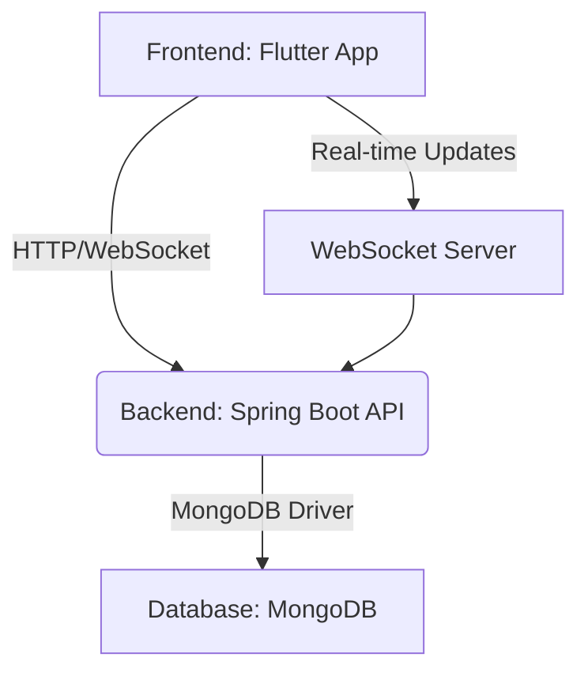

# SyncForge

 

SyncForge is a robust, collaborative project management platform designed to empower teams with streamlined workflows, efficient task management, and seamless communication. It offers a comprehensive suite of features within a centralized environment for creating projects, assigning tasks, tracking progress, and collaborating on files in real-time.

## Table of Contents

- [Features](#features)
- [Technologies Used](#technologies-used)
- [Getting Started](#getting-started)
  - [Prerequisites](#prerequisites)
  - [Installation](#installation)
- [Project Structure](#project-structure)
- [System Architecture](#system-architecture)
- [Contributing](#contributing)
- [License](#license)
- [Contact](#contact)

## Features

SyncForge offers a rich set of features to enhance team productivity and project oversight:

*   **User Authentication & Authorization**: Secure user registration, login, and robust role-based access control to manage permissions effectively.
*   **Project Management**: Comprehensive tools to create, view, and manage projects. Facilitates team collaboration by allowing members to be added with defined roles.
*   **Task Management**: Create, assign, and track tasks within projects. Monitor task status and progress with intuitive updates.
*   **AI-powered Task Description Generation**: Leverage artificial intelligence to automatically generate detailed and coherent task descriptions, saving time and ensuring clarity.
*   **Dashboard for Project Overview**: A dynamic dashboard providing a holistic view of project progress, key performance indicators, and critical metrics.
*   **User Profiles & Roles**: Manage individual user profiles and assign distinct roles with varying permissions, ensuring proper access and accountability.
*   **File Management**: Securely upload, organize, share, and manage file versions associated with projects.
*   **Real-time Communication**: Integrated WebSocket-based notifications and communication channels for instant updates on project activities, task changes, and new comments.
*   **Comment System**: Facilitate discussions and feedback loops with a dedicated commenting system for tasks and files.
*   **Integration with External Calendars**: Seamlessly synchronize tasks and deadlines with external calendar applications for enhanced scheduling.

## Technologies Used

SyncForge is built with a modern technology stack, ensuring scalability, performance, and a rich user experience.

### Backend (Spring Boot)

*   **Spring Boot**: The foundational framework for developing robust, production-ready backend services.
*   **Spring Security**: Provides comprehensive security services, including JWT-based authentication and authorization.
*   **Spring WebSockets**: Enables real-time, bidirectional communication between clients and the server for live updates.
*   **Spring Data MongoDB**: Facilitates efficient interaction with the MongoDB NoSQL database.
*   **Lombok**: Reduces boilerplate code, enhancing code readability and maintainability.
*   **jjwt**: A compact, easy-to-use Java library for JSON Web Token (JWT) creation and verification.

### Frontend (Flutter)

*   **Flutter**: Google's UI toolkit for building beautiful, natively compiled applications for mobile, web, and desktop from a single codebase.
*   **Provider**: A robust state management solution for Flutter applications.
*   **http**: A popular package for making HTTP requests to interact with RESTful APIs.
*   **file_picker**: Enables users to pick single or multiple files from their device storage.
*   **path_provider**: Provides access to platform-specific directories for storing application data.
*   **permission_handler**: A cross-platform plugin to handle and request permissions.
*   **web_socket_channel**: Provides a `StreamChannel` for easy WebSocket communication.
*   **flutter_secure_storage**: A Flutter plugin to store data securely on the device.
*   **google_fonts**: Integrates Google Fonts into Flutter applications.
*   **stomp_dart_client**: A STOMP client for Dart, facilitating WebSocket communication with STOMP brokers.

## Getting Started

Follow these instructions to set up and run SyncForge on your local machine for development and testing purposes.

### Prerequisites

Ensure you have the following software installed:

*   **Java Development Kit (JDK) 21 or higher**: Required for the Spring Boot backend.
*   **Flutter SDK**: Essential for building and running the Flutter frontend application.
*   **Docker and Docker Compose**: Used for containerizing the MongoDB database and potentially other services.
*   **MongoDB**: A NoSQL database. You can either install it directly or use the provided Docker Compose setup for a containerized instance.

### Installation

1.  **Clone the repository**:

    ```bash
    git clone https://github.com/your-username/SyncForge.git
    cd SyncForge
    ```

2.  **Start the MongoDB database (using Docker Compose)**:

    Navigate to the root directory of the cloned repository and execute:

    ```bash
    docker-compose up -d mongo
    ```
    This command will start the MongoDB container in detached mode.

3.  **Backend Setup**:

    Navigate into the `backend` directory:

    ```bash
    cd backend
    ```
    Then, run the Spring Boot application:

    ```bash
    ./mvnw spring-boot:run
    ```
    The backend service will be accessible at `http://localhost:8080`.

4.  **Frontend Setup**:

    Navigate to the Flutter frontend project directory:

    ```bash
    cd ../frontend/syncforge_frontend
    ```
    Install the dependencies:

    ```bash
    flutter pub get
    ```
    Finally, run the Flutter application:

    ```bash
    flutter run
    ```
    The Flutter application will launch on your configured device or web browser.

## Project Structure

The repository is organized into the following main directories:

```
SyncForge/
├── backend/               # Spring Boot backend application
│   ├── src/
│   │   ├── main/
│   │   │   ├── java/com/syncforge/ # Main application source code
│   │   │   ├── resources/          # Configuration files
│   │   └── test/                   # Test code
│   ├── Dockerfile                  # Dockerfile for the backend
│   ├── pom.xml                     # Maven project file
│   └── ...                         # Other backend-related files
├── frontend/              # Flutter frontend application
│   └── syncforge_frontend/ 
│       ├── lib/                    # Dart source code for the Flutter app
│       ├── assets/                 # Image and font assets
│       ├── android/                # Android specific configuration and code
│       ├── ios/                    # iOS specific configuration and code
│       ├── web/                    # Web specific configuration and code
│       ├── pubspec.yaml            # Flutter project dependencies and metadata
│       └── ...                     # Other frontend-related files
├── docker-compose.yml     # Docker Compose configuration for services like MongoDB
└── README.md              # Project documentation (this file)
```

## System Architecture

The system architecture of SyncForge is depicted below, illustrating the interaction between its core components:



## Contributing

We welcome contributions to SyncForge! To contribute, please follow these guidelines:

1.  **Fork the repository**.
2.  **Create a new branch** for your feature or bug fix.
3.  **Make your changes** and ensure they adhere to the project's coding standards.
4.  **Write clear, concise commit messages**.
5.  **Submit a pull request** to the `main` branch, detailing your changes and their purpose.

## License

This project is licensed under the MIT License - see the `LICENSE.md` file for details. Please note that the `LICENSE.md` file is a placeholder and needs to be created.

## Contact

For any inquiries or support, please open an issue in the GitHub repository or contact [your-email@example.com](mailto:your-email@example.com).
